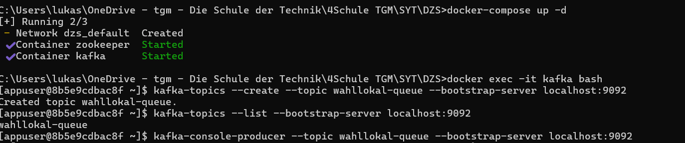
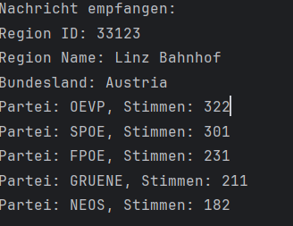

# MOM - Kafka
**Schrenk Lukas**

## Aufgabenstellung
Die Aufgabe bestand darin, eine Kommunikationsplattform für Wahllokale zu entwickeln, bei der JSON-Daten mithilfe von Apache Kafka zwischen Wahllokalen und einer zentralen Instanz ausgetauscht werden. Ziel war es, die JSON-Daten in einer zentralen Queue zu sammeln und anschließend zu verarbeiten.


## Fragestellung
1. Nennen Sie mindestens 4 Eigenschaften der Message Oriented Middleware (MOM):  
   Asynchrone Kommunikation: Nachrichten können gesendet werden, ohne auf eine Antwort zu warten.  
   Entkopplung: Sender und Empfänger arbeiten unabhängig voneinander.  
   Zuverlässigkeit: Nachrichten können persistent gespeichert werden.  
   Skalierbarkeit: Unterstützt hohe Nachrichtenvolumen und mehrere Clients.

2. Was versteht man unter einer transienten und synchronen Kommunikation?  
   Transiente Kommunikation: Nachrichten gehen verloren, wenn der Empfänger offline ist.  
   Synchrone Kommunikation: Der Sender wartet, bis der Empfänger die Nachricht bestätigt oder verarbeitet.

3. Beschreiben Sie die Funktionsweise einer JMS Queue:  
   Eine JMS Queue basiert auf dem Punkt-zu-Punkt-Modell. Der Sender legt Nachrichten in die Warteschlange. Der Empfänger nimmt sie von dort ab. Jede Nachricht wird nur von einem Empfänger verarbeitet.

4. JMS Overview - Beschreiben Sie die wichtigsten JMS Klassen und deren Zusammenhang:  
   ConnectionFactory: Erstellt Verbindungen zum JMS-Provider.  
   Connection: Verbindung zum JMS-Provider.  
   Session: Ermöglicht das Senden und Empfangen von Nachrichten.  
   Destination: Ziel einer Nachricht (z. B. Queue oder Topic).  
   MessageProducer: Sendet Nachrichten.  
   MessageConsumer: Empfängt Nachrichten.

5. Beschreiben Sie die Funktionsweise eines JMS Topic:  
   Ein JMS Topic verwendet das Publish-Subscribe-Modell. Der Publisher sendet Nachrichten an das Topic. Alle aktiven Abonnenten erhalten eine Kopie der Nachricht. Unterstützt auch persistente Abonnements.

6. Was versteht man unter einem lose gekoppelten verteilten System?  
   Lose gekoppelte Systeme arbeiten unabhängig voneinander und kommunizieren über eine Middleware wie JMS. Beispiel: Ein Wahllokal sendet Daten über Kafka an eine zentrale Stelle, die später verarbeitet werden können. Lose gekoppelt, da Sender und Empfänger nicht direkt voneinander abhängen.

## Umsetzung

### Einrichtung der Kafka-Umgebung
Apache Kafka wurde mithilfe von Docker eingerichtet. Dazu wurde eine docker-compose.yml erstellt, die sowohl Kafka als auch Zookeeper enthält. Nach dem Start wurden die Container überprüft und ein Topic namens wahllokal-queue erstellt. Dieses Topic dient als zentrale Queue für alle Nachrichten.
<br> Docker Compose:
```yaml
version: '3.8'
services:
  zookeeper:
    image: confluentinc/cp-zookeeper:7.5.0
    container_name: zookeeper
    ports:
      - "32181:2181"
    environment:
      ZOOKEEPER_CLIENT_PORT: 2181
      ZOOKEEPER_TICK_TIME: 2000

  kafka:
    image: confluentinc/cp-kafka:7.5.0
    container_name: kafka
    ports:
      - "9092:9092"
    environment:
      KAFKA_BROKER_ID: 1
      KAFKA_ZOOKEEPER_CONNECT: zookeeper:2181
      KAFKA_ADVERTISED_LISTENERS: PLAINTEXT://localhost:9092
      KAFKA_OFFSETS_TOPIC_REPLICATION_FACTOR: 1
    depends_on:
      - zookeeper
```

### JSON-Datenstruktur
Es wurde ein Datenmodell definiert, das die JSON-Struktur abbildet. Die Hauptklasse ElectionData enthält Informationen zu einer Region sowie eine Liste von Parteien und deren Stimmenanzahl. Ergänzende Klassen wie CountingData und Party wurden ebenfalls implementiert.

### Producer
Der Producer wurde als Java-Klasse WahllokalProducer implementiert. Dabei wurde die Bibliothek Jackson verwendet, um die Daten im JSON-Format zu serialisieren und an das Kafka-Topic zu senden. Die gesendeten Daten wurden in der Kafka-CLI überprüft.

### Consumer
Der Consumer wurde in der Klasse ZentralConsumer umgesetzt. Diese Klasse empfängt die JSON-Daten aus dem Kafka-Topic und deserialisiert sie mithilfe von Jackson. Die deserialisierten Daten wurden anschließend in der Konsole ausgegeben.

## Ergebnisse


## Quellen
- Apache Kafka: https://kafka.apache.org/
- IBM - Message Oriented Middleware: https://www.ibm.com/cloud/what-is-message-oriented-middleware
- Confluent - What is Apache Kafka?: https://www.confluent.io/what-is-apache-kafka/
- Red Hat - Message-Oriented Middleware: https://www.redhat.com/en/topics/integration/what-is-message-oriented-middleware
- Kafka Documentation - Messaging Systems: https://kafka.apache.org/documentation/